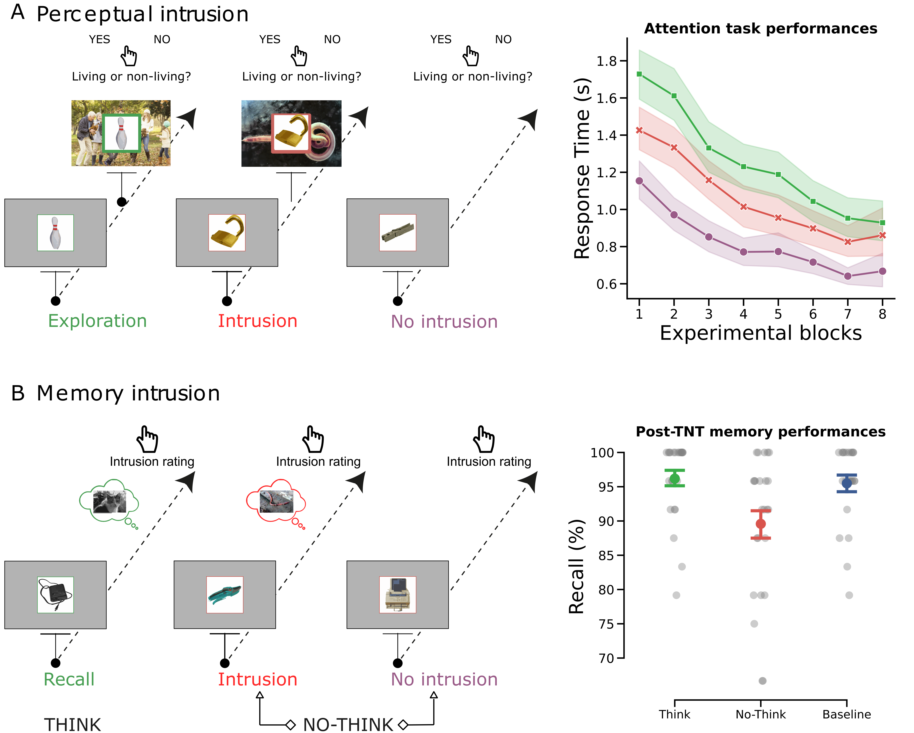
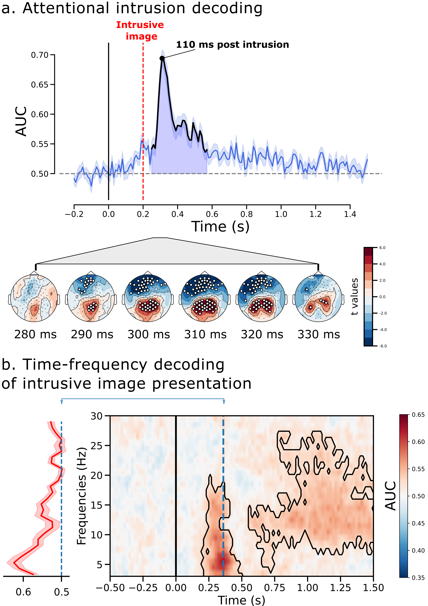

# Decoding memory intrusions from early visual interference
Data and code for the paper.

## Data

Data are stored in the `data` folder:

* `behavior.txt`

* `merged.txt`

* `metacognition.txt`

## Code

Scripts and jupyter notebooks are tored in the `code` folder.

### Notebooks

* `Figures.ipynb` contains  goupd level summary analysis and figures reported in the paper.

### Scripts

* `1_run_filter.py` .

* `2_run_epochs.py` .

* `3_run_ica.py` .

* `4_run_autoreject.py` .

* `5_attention_decoding.py` .

## Figures

### Figure 1:

**Figure 1**

### Figure 2:

**Figure 2**

### Figure 3:

**Figure 3**
